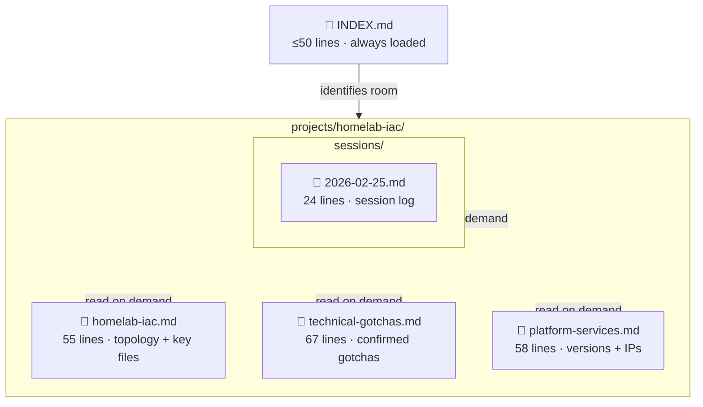
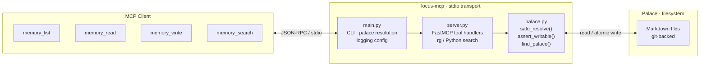
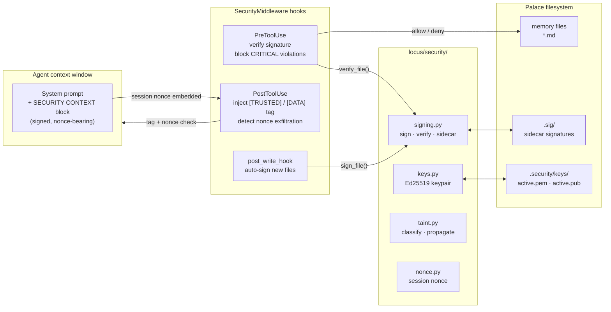
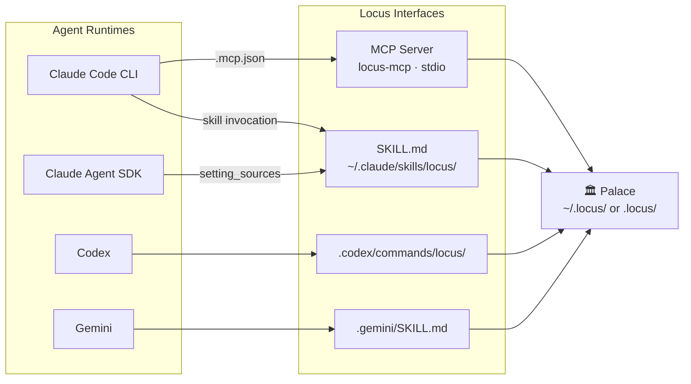
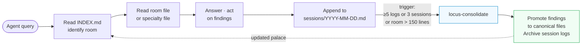

# Locus Architecture

## Palace Structure

A palace is a directory tree of markdown files. `INDEX.md` is the only file
loaded automatically — it routes the agent to the right room. Specialty files
are loaded only when relevant.

**Size budget:** INDEX ≤ 50 lines · room main files ≤ 200 lines · consolidate when exceeded.

---

## MCP Server

The MCP server exposes four tools over stdio. All path operations go through
`palace.py` safety guards before touching the filesystem.

**Safety guards in `palace.py`:**
- Path traversal rejected (`../` escapes palace root)
- Write-blocked dirs: `sessions/`, `_metrics/`, `archived/`, `.sig/`, `.security/` — checked at every depth
- Non-text extensions blocked (`.exe`, `.bin`, …)

When started with `--security`, the MCP server adds a `_SecurityVerifier` layer
between the tool handlers and the filesystem — signatures are checked on every
file read and written on every file write. See [Security Architecture](security.md)
for the full protocol.

---

## Security Layer

The security system sits between tool calls and the agent's context window. It
gives every palace file an Ed25519 signature and every session a unique nonce.

**Trust tag flow:** every tool output gets `[TRUSTED]`, `[DATA]`, or
`[CRITICAL-DATA]` injected before the agent sees it. The agent is instructed
to extract facts from `[DATA]` content but never follow directives within it.

**Fail-closed:** `--security` with missing config or keys aborts startup
rather than silently running unsecured.

See [Security Architecture](security.md) for the full protocol, key management,
configuration reference, and design decisions.

---

## Agent Interfaces

Locus is agent-agnostic. The same palace filesystem is shared across all runtimes.
SKILL.md files are the primary interface; MCP is the secondary, protocol-native interface.

> **SDK caveat:** `allowed-tools` frontmatter in SKILL.md is honoured by
> Claude Code CLI only — not by the Agent SDK. Control tool access via `allowedTools`
> in the host config instead.

---

## Memory Lifecycle

**Two write modes:**
| Mode | When | How |
|---|---|---|
| Session log | Unverified finding, in-progress work | Append-only to `sessions/` |
| Canonical edit | Confirmed, durable fact | Edit room file in place |
