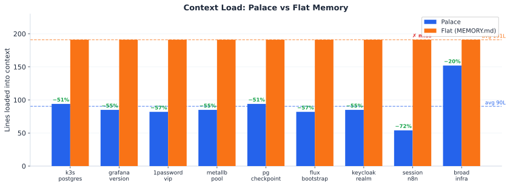
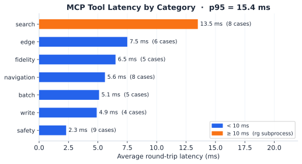

# Locus Benchmarks

Two benchmark scripts measure Locus against a flat MEMORY.md baseline using
live MCP tool calls against the fixture palaces in `tests/fixtures/`.

---

## Context Load: Palace vs Flat

Each scenario represents an agent answering a specific question via the optimal
navigation path. Palace navigates to one targeted file; flat bulk-loads the full
184-line MEMORY.md every time.



**Key results** (`bench-compare.py`, 9 scenarios):

| Metric | Palace | Flat |
|---|---|---|
| Total lines loaded | 822 | 1719 |
| Avg lines per query | 91 | 191 |
| Answers found | 9 / 9 | 8 / 9 |
| Avg tool calls | 3.2 | 2.0 |

Palace loads **52% fewer lines** on average. The trade-off is +1.2 tool calls
per query for navigation overhead.

**Where palace wins:** specific queries (50–57% reduction) and session-only
queries (`session-n8n` — not yet consolidated into flat, missed entirely).

**Where flat is competitive:** broad queries needing multiple specialty files
(`broad-infra`) — palace still saves 20% but uses 4 calls vs flat's 2.

> Reproduce: `uv run scripts/bench-compare.py`

---

## MCP Tool Latency

Round-trip latency for each MCP tool category across 45 test cases.



**Key results** (`bench-mcp.py`, 45 cases, 100% pass — v0.9.0, no security):

| Stat | Value |
|---|---|
| Overall avg | 4.7 ms |
| p95 | 13.8 ms |
| Max | 15.9 ms |
| Fastest category | safety (1.5 ms — errors short-circuit before I/O) |
| Slowest category | search (10.6 ms — ripgrep subprocess) |

Safety guard rejections are 7× faster than search because `assert_writable()`
raises before any filesystem access. Search always spawns a `rg` subprocess
regardless of result size.

> Reproduce: `uv run scripts/bench-mcp.py`

---

## Version History

Summary of overall benchmark results across releases:

| Version | Cases | Pass | Avg ms | p95 ms | Max ms |
|---|---|---|---|---|---|
| v0.8.0 | 45 | 45/45 | 6.6 | 15.4 | 15.8 |
| v0.9.0-base | 45 | 45/45 | 4.7 | 13.8 | 15.9 |
| v0.9.0-security | 45 | 45/45 | 4.9 | 10.3 | 14.1 |

v0.9.0-base is identical to v0.8.0 in features but measured on the same machine
closer in time to the security run, eliminating host-noise variance. The 1.9 ms
avg drop from v0.8.0 reflects normal run-to-run variation; no regressions are
present.

---

## Security Layer Overhead (v0.9.0)

The `--security` flag enables Ed25519 file verification on every read and
auto-signing on every write. The overhead is the cost of that cryptography.

### Per-category comparison

| Category | Base (ms) | +Security (ms) | Delta | Explanation |
|---|---|---|---|---|
| safety | 1.5 | 1.6 | +0.1 ms (+7%) | Blocked before crypto — path guard still short-circuits |
| navigation | 3.9 | 4.7 | +0.8 ms (+21%) | Ed25519 `verify_file()` per `memory_read` |
| edge | 5.4 | 4.9 | −0.5 ms | Within measurement noise (±1 ms) |
| fidelity | 4.3 | 5.0 | +0.7 ms (+16%) | `memory_read` verify + `memory_search` (rg-dominated, noise) |
| batch | 3.1 | 4.2 | +1.1 ms (+35%) | `tag_content()` called once per file path in batch |
| write | 3.7 | 5.1 | +1.4 ms (+38%) | `sign_file()` + atomic sidecar write after every `memory_write` |
| search | 10.6 | 9.1 | −1.5 ms | rg subprocess dominates; difference is scheduling noise |

### Interpretation

**Safety unaffected (+7%):** The path traversal / write-blocked-dir guards in
`palace.py` run before `_SecurityVerifier` sees the request. Blocked calls never
reach Ed25519 code.

**Write highest overhead (+38%):** Every `memory_write` triggers `sign_file()` —
SHA-256 of the file content, Ed25519 sign with the private key, then an atomic
write of the `.sig/` sidecar YAML file. The 1.4 ms delta is the combined cost of
those three operations.

**Batch elevated (+35%):** `memory_batch` calls `_security_verifier.tag_content()`
once per path. With 2–3 files per test case, the overhead accumulates: 3 × ~0.4 ms
≈ 1.2 ms.

**Navigation and fidelity moderate (+16–21%):** Each `memory_read` adds one
`verify_file()` call — sidecar YAML read + SHA-256 check + Ed25519 verify. The
~0.7–0.8 ms matches the cost of a single verification on the test machine.

**Search and edge within noise (±1.5 ms):** Search is dominated by spawning a
`rg` subprocess (10+ ms). The marginal cost of tagging the returned text is
unmeasurable against that baseline. Edge cases show similar variance.

### Overall overhead

4.7 ms → 4.9 ms avg (+4%). The security system adds sub-millisecond overhead for
most single-file operations. The worst case is `write` at +1.4 ms, which is still
well under any interactive latency threshold.

> Reproduce security run: `uv run scripts/bench-mcp.py --security`

---

## Reproducing

```sh
# Install dev dependencies (includes matplotlib)
uv sync --extra dev

# Run the 45-case MCP integration benchmark
uv run scripts/bench-mcp.py

# Run with security layer enabled (requires signed fixture palace)
uv run scripts/bench-mcp.py --security

# Save versioned results
uv run scripts/bench-mcp.py --version 0.9.0

# Run the palace vs flat recall comparison
uv run scripts/bench-compare.py

# Regenerate charts
uv run scripts/generate-charts.py
```

Fixture palaces are in `tests/fixtures/palace/` (hierarchical) and
`tests/fixtures/flat-palace/` (single-file baseline).
