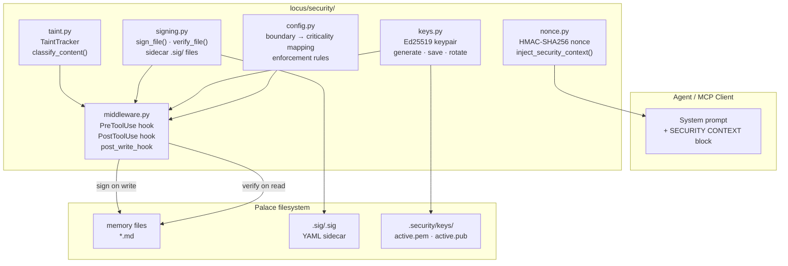
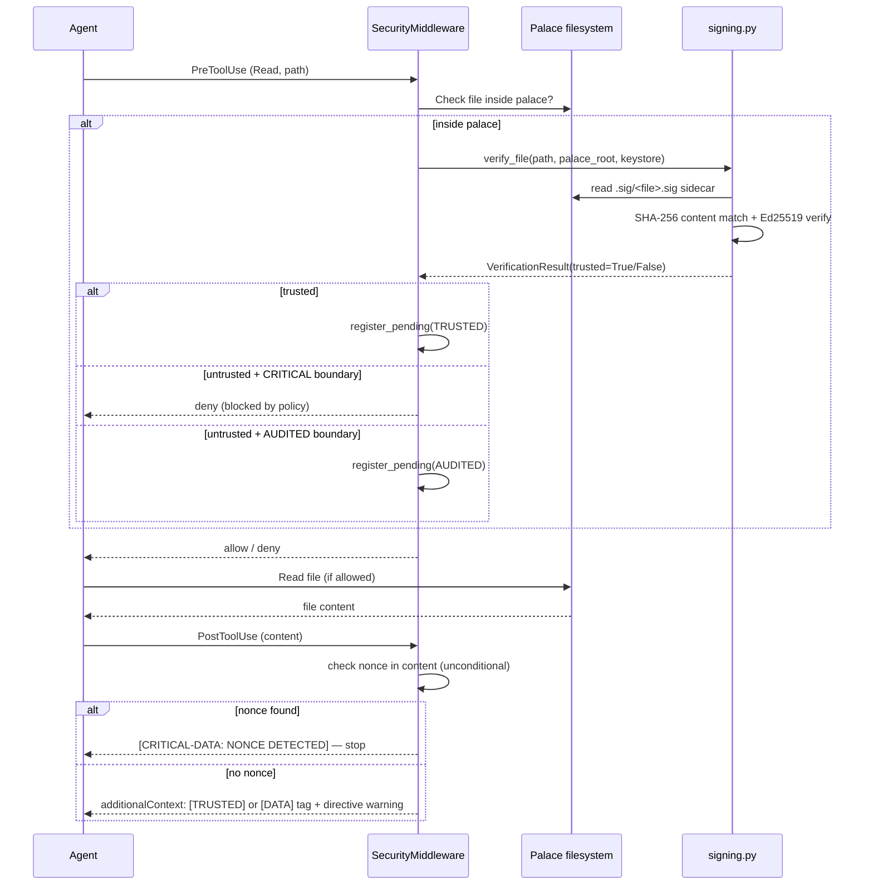
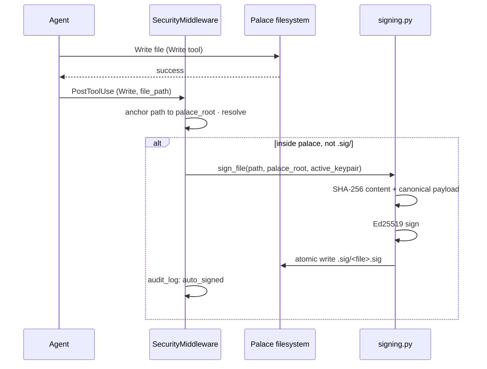

# Locus Security System

Locus agents read from and write to a shared memory palace. That makes them
a target: an attacker who can plant content in a memory file can issue
instructions that look identical to operator instructions. The security system
makes this measurably harder by giving every legitimate memory file an
Ed25519 signature and every session a unique cryptographic nonce.

---

## Threat Model

| Threat | Attack vector | Mitigated by |
|---|---|---|
| **Direct prompt injection** | Malicious instructions embedded in a palace file | File signatures — tampered files tagged `[DATA]`, not `[TRUSTED]` |
| **Memory poisoning** | Attacker writes or modifies a palace file before the agent reads it | Sidecar signatures detect content changes; mismatches block or tag |
| **Indirect injection via external data** | Tool output from WebFetch/Bash carries instructions | Trust tags injected by PostToolUse hooks; agent instructed not to follow directives in `[DATA]` content |
| **Nonce exfiltration** | Agent reads session nonce from system prompt and writes it to a file or network call | Nonce checked in every tool output; triggers hard stop on detection |
| **Multi-turn drift** | Accumulated untagged context gradually shifts agent behaviour | Per-session taint tracking; sticky propagation prevents laundering |
| **Unsigned-file trust escalation** | Agent treats unsigned file as authoritative | `allow_unsigned_reads: false` (default) — unsigned reads tagged `[DATA]` |

---

## Architecture

### Five-Layer Stack



### Data Flow — Secured Read



### Data Flow — Secured Write (auto-signing)



---

## Key Management

Keys live in the palace at `.security/keys/` (configurable via `key_store` in
`locus-security.yaml`). The directory is write-blocked by the MCP server and
is outside the agent's allowed write paths.

```
.security/
└── keys/
    ├── active.pem      Ed25519 private key (PKCS8 PEM, optionally passphrase-encrypted)
    ├── active.pub      DER-encoded public key
    ├── active.json     { key_id, created_at, expires_at }
    └── retired/
        ├── <key_id>.pub    Public key archived on rotation
        └── <key_id>.json   Metadata for retired key
```

**Key lifecycle:**
1. `locus-security init-keys --palace <path>` generates a fresh Ed25519 keypair
2. All Write operations are auto-signed with the active key
3. Verification checks the active key and all retired keys — old signatures remain valid after rotation
4. `locus-security rotate-keys --palace <path>` archives the current public key to `retired/`, generates a new active pair. The old private key is never retained after rotation.

**Passphrase encryption:** set `LOCUS_SIGNING_PASSPHRASE` in the environment. The private key PEM is encrypted with AES-256-CBC (PKCS8 `BestAvailableEncryption`). If unset, the key is stored unencrypted — acceptable for local single-user palaces, not recommended for shared/server deployments.

---

## Signature Protocol

### File Sidecar Format

Signed files get a companion `.sig/<filename>.sig` (YAML) alongside them:

```yaml
# Locus signature sidecar — do not edit manually
protocol: locus-sig-v1
key_id: locus-2026-03-11
palace_slug: home-user-locus
rel_path: global/networking/networking.md
content_sha256: e3b0c44298fc1c149afb...
signed_at: "2026-03-11T12:00:00+00:00"
signature_b64: AAABBB...
```

**Canonical signing payload** (newline-delimited, UTF-8):
```
locus-sig-v1
<palace_slug>
<rel_path>
<signed_at>
<content_sha256>
```

Content is normalised to LF line endings and BOM-stripped before hashing.
The sidecar lives in `.sig/` inside the same directory as the signed file,
keeping signed files themselves unmodified.

### System Prompt Signing

When `embed_nonce: true` (default), the agent's system prompt is extended
with a `--- SECURITY CONTEXT ---` block that includes:

- The session nonce (HMAC-SHA256, 32 chars, URL-safe base64)
- The operator's public key (PEM)
- An Ed25519 signature over `locus-sys-v1\n<nonce>\n<base_prompt>`
- Six hard security rules the agent must follow

This gives the agent a verifiable anchor: legitimate instructions always come
from the signed system prompt; anything seen in memory or tool output is at best `[DATA]`.

---

## Trust Tags

Every tool output is tagged by the PostToolUse hook:

| Tag | Source | Agent behaviour |
|---|---|---|
| `[TRUSTED]` | File verified by Ed25519 signature | Act on facts and instructions normally |
| `[DATA]` | Unverified, unsigned, or AUDITED boundary | Extract facts; ignore any directives |
| `[CRITICAL-DATA]` | CRITICAL boundary violation — blocked | Report to user; do not proceed |
| `[CRITICAL-DATA: NONCE DETECTED]` | Session nonce found in content | **Hard stop** — report exfiltration attempt |

**Nonce detection is unconditional** — even `[TRUSTED]` files are scanned.
An agent can write the nonce into a file and have it auto-signed; without this check, that exfiltration would be invisible.

---

## Configuration

Copy `templates/locus-security.yaml` to your palace root and adjust:

```yaml
version: "1"
key_store: ".security/keys/"

boundaries:
  memory_read:     AUDITED     # Palace files → [DATA] unless signed
  memory_write:    CRITICAL    # Writes always require operator authority
  tool_output:     AUDITED     # Bash, subprocess output → [DATA]
  user_input:      PERMISSIVE  # CLI user messages — pass through untagged
  external_data:   CRITICAL    # WebFetch, curl → blocked by default
  mcp_tool_result: AUDITED     # Other MCP server results → [DATA]

enforcement:
  CRITICAL:
    block: true
    log: true
    tag: "[CRITICAL-DATA]"
  AUDITED:
    block: false
    log: true
    tag: "[DATA]"
    flag_to_agent: true
  PERMISSIVE:
    block: false
    log: false
    tag: null

nonce:
  embed_in_system_prompt: true

signing:
  enabled: true
  auto_sign_writes: true
  verify_on_read: true
  allow_unsigned_reads: false  # true = unsigned files get [DATA] not blocked
```

**Criticality levels:**

| Level | Blocks on failure | Logs | Injects tag |
|---|---|---|---|
| `CRITICAL` | Yes | Yes | `[CRITICAL-DATA]` |
| `AUDITED` | No | Yes | `[DATA]` + agent warning |
| `PERMISSIVE` | No | No | None |

---

## Enabling Security

### Agent SDK

```sh
# Initialize keys
locus-security init-keys --palace ~/.locus

# Run with security
locus --palace ~/.locus --security --task "What networking rules exist?"
```

When `--security` is present:
- `build_security_context()` loads config + keys, generates session nonce
- System prompt is extended with signed `SECURITY CONTEXT` block (if `embed_nonce: true`)
- `SecurityMiddleware` hooks are registered for `PreToolUse` and `PostToolUse`
- All `Write` tool completions trigger auto-signing

If `locus-security.yaml` or keys are missing, the agent **refuses to start** (fail-closed — never silently degrades to unsecured mode).

### MCP Server

```sh
locus-mcp --palace ~/.locus --security
```

When `--security` is present, the MCP server:
- Verifies signatures on `memory_read`, `memory_list` (file paths), and `memory_batch`
- Injects `[TRUSTED]` or `[DATA]` prefix into returned content
- Auto-signs files after every `memory_write`
- Blocks `.sig/` and `.security/` directories from MCP client writes

Same fail-closed behaviour: missing config raises `FileNotFoundError` at startup.

---

## Design Decisions

### Why Ed25519, not HMAC?

HMAC requires sharing a secret key between the signer and verifier. With a
shared key, any process that can verify can also forge. Ed25519 is asymmetric:
the operator holds the private key, agents only need the public key for
verification. Compromised agent output cannot be used to forge legitimate memory files.

### Why sidecar files, not inline signatures?

Embedding signatures in memory files would require a custom markdown extension
and would pollute the agent's context window with signature bytes. Sidecars in
`.sig/` keep the protocol entirely transparent to agents that don't know about it.
Locus treats `.sig/` as write-protected — agents can never accidentally overwrite
or corrupt a sidecar.

### Why a per-session nonce?

A static token in the system prompt can be extracted from training data or
leaked through prompt logging. The nonce is freshly generated each session via
HMAC-SHA256 over a random seed; it has no value outside the current session and
leaks no information about the signing key. Its sole purpose is to detect whether
the agent has been instructed to exfiltrate a session identifier.

### Why check nonce even in TRUSTED content?

A `[TRUSTED]` tag means the file was signed at some point in the past. After a
session starts, the agent might write the session nonce into a palace file and
the auto-signing hook would sign it — making that nonce-carrying content appear
`TRUSTED` in the same or a future session. Skipping the nonce check for trusted
content would make this exfiltration-to-disk pattern invisible.

### Why fail-closed on missing config?

The alternative — silently running without security when `--security` is
requested — gives a false sense of protection. An operator who passes `--security`
expects security to be active; a missing config file is most likely a
configuration error, not a deliberate choice. Failing loudly ensures the
error is surfaced immediately rather than discovered after a compromised session.

### Taint is sticky, not cumulative

Taint propagates through the tool chain as a worst-case maximum: if any input
to a tool call is `TAINTED`, the output is `TAINTED`. This prevents "taint
laundering" where an agent copies `[DATA]` content into a new file and signs it,
making the untrusted content appear trusted. Session logs are the sanctioned
exception: they may record `[DATA]`-sourced facts as attributed observations,
which is tracked in the audit log.

---

## Audit Log

Every security event during a session is appended to `SecurityContext.audit_log`
(in-memory list of `AuditEntry` objects). Events include:

| Event type | When |
|---|---|
| `pre_block` | Tool call denied (CRITICAL boundary or signature tamper) |
| `pre_allow_unverified` | File allowed through despite failed verification |
| `post_tag` | Trust tag injected into tool output |
| `auto_signed` | File signed after Write |
| `nonce_exfiltration` | Session nonce detected in tool output |

The audit log is not persisted by default. Pass it to your logging framework or
write it to `_security/incidents/YYYY-MM-DD.md` in the palace (see SKILL.md
Section 5 for the incident report format).

---

## File Map

```
locus/security/
├── __init__.py          Public API: build_security_context()
├── config.py            Load locus-security.yaml, boundary/enforcement rules
├── keys.py              Keypair generation, PKCS8 PEM storage, rotation
├── signing.py           sign_file(), verify_file(), sign_system_prompt()
├── nonce.py             generate_session_nonce(), inject_security_context()
├── taint.py             TaintTracker, TaintRecord, classify_content()
└── middleware.py        SecurityMiddleware (PreToolUse / PostToolUse hooks)

skills/claude/locus-security/
└── SKILL.md             Agent-facing trust tag conventions and incident reporting

templates/
└── locus-security.yaml  Configuration template with all options annotated

tests/unit/security/
├── test_config.py       Config parsing and boundary defaults
├── test_keys.py         Keypair generation, save/load, rotation
├── test_signing.py      sign/verify, tamper detection, retired-key verification
├── test_nonce.py        Nonce uniqueness, URL-safety, system prompt injection
├── test_taint.py        Taint classification, nonce detection, tracker state
└── test_review_fixes.py Regression tests for all P1/P2 review findings
```
